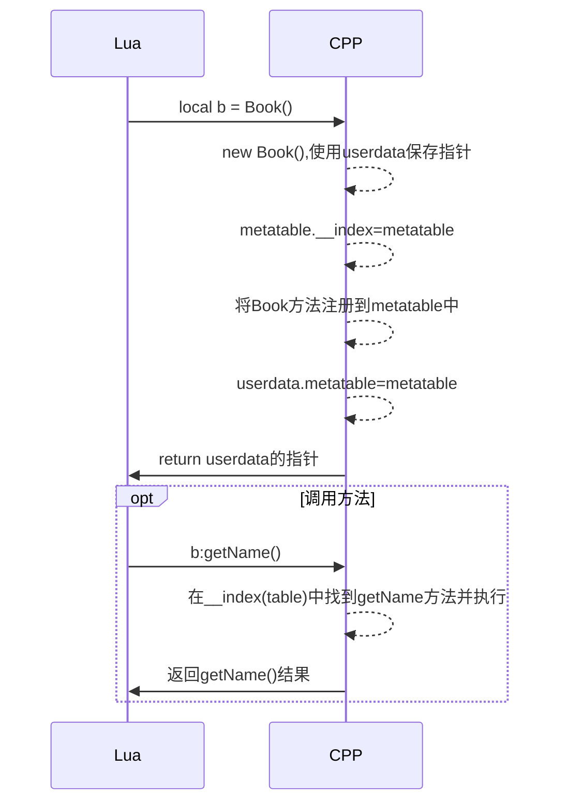
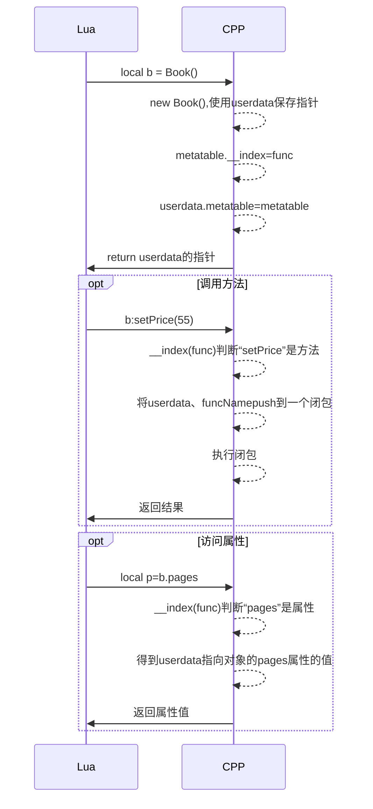

回首再看一下[Lua的C API学习小结][api小结]，发现Lua访问C\+\+时有许多局限性

## I. 现有问题

* 1. 只能注册C\+\+方法，导致没办法访问C\+\+对象的属性
* 2. 必须提前注册好，不灵活，扩展性不强



怎么解决上述问题呢？只能继续从元方法\_\_index入手。之前metatable的\_\_index指向的是metatable自身，指向的是一个table。现在我们可以让\_\_index指向一个方法，然后在该方法中具体处理Lua访问C\+\+对象的属性和方法的问题。


## II. 解决

### 2.1 了解用到的概念

* __index
>__index: 索引table[key]。当table不是表或是表table中不存在key这个键时，这个事件被触发。此时，会读出table相应的元方法。 尽管名字取成这样，这个事件的元方法其实可以是一个函数也可以是一张表。如果它是一个函数，则以table和key作为参数调用它。如果它是一张表，最终的结果就是以key取索引这张表的结果。（这个索引过程是走常规的流程，而不是直接索引，所以这次索引有可能引发另一次元方法。）

* lua_pushcclosure
```C
// 把一个新的C闭包压栈。
void lua_pushcclosure (lua_State *L, lua_CFunction fn, int n);
```

### 2.2 大致时序图



### 2.3 例子代码修改
Book.cpp

```C++
class Book
{
private:
	const char* name;
	float price;

public:
	int page = 88;
	
public:
	Book(const char* name)
	{
		this->name = name;
	}

	const char* getName()
	{
		return name;
	}

	void setPrice(float price)
	{
		this->price = price;
	}

	float getPrice()
	{
		return price;
	}
};
```

C++代码

```C++
int newBook(lua_State* L)
{
	const char* name = luaL_checkstring(L, -1);
	Book** book = (Book**)lua_newuserdata(L, sizeof(Book));
	*book = new Book(name);
	luaL_setmetatable(L, "Book");
	return 1;
}

Book* checkBook(lua_State* L)
{
	void* ud = luaL_checkudata(L, 1, "Book");
	Book* book = *(Book**)ud;
	return book;
}

int getName(lua_State* L)
{
	Book* book = checkBook(L);
	const char* name = book->getName();
	lua_pushstring(L, name);
	return 1;
}

int setPrice(lua_State* L)
{
	Book* book = checkBook(L);
	float price = luaL_checknumber(L, -1);
	book->setPrice(price);
	return 0;
}

int getPrice(lua_State* L)
{
	Book* book = checkBook(L);
	lua_pushnumber(L, book->getPrice());
	return 1;
}

int closure(lua_State* L)
{
	const char* funcName = luaL_checkstring(L, lua_upvalueindex(2));

	std::map<const char*, lua_CFunction> map;
	std::map<const char*, lua_CFunction>::iterator iter;
	map["getName"] = getName;
	map["setPrice"] = setPrice;
	map["getPrice"] = getPrice;
	for(iter = map.begin(); iter != map.end(); iter++)
	{
		if (strcmp(iter->first, funcName) == 0)
		{
			auto func = iter->second;
			return func(L);
		}
	}
	char s[100] = "error, has not found function:";
	strcat_s(s, sizeof(s), funcName);
	lua_pushstring(L, s);
	return 1;
}

int index(lua_State* L)
{
	const char* member = luaL_checkstring(L, -1);
	if (strcmp(member, "pages") == 0)
	{
		lua_pushinteger(L, checkBook(L)->page);
		return 1;
	}
	lua_pushcclosure(L, closure, 2);
	return 1;
}

int luaopen_book(lua_State* L) {
	//metatable.__index = metatable
	luaL_newmetatable(L, "Book");
	lua_pushcfunction(L, index);
	lua_setfield(L, -2, "__index");

	lua_register(L, "Book", newBook);
	return 1;
}

int main()
{
	lua_State *L = luaL_newstate();
	luaL_openlibs(L);
	luaopen_book(L);
	luaL_dofile(L, "test.lua");
	lua_close(L);
}
```

test.lua

```lua
local book = Book("Math")
book:setPrice(50.5)
print("book:getPrice()=", book:getPrice())
print("book's name=", book:getName())
print("book's pages=", book.pages)

-- Book没有hello这个方法
print(book:hello("abc", 1))
```

运行结果：
>book:getPrice()=        50.5
book's name=    Math
book's pages=   88
error, has not found function:hello

### 2.4 赋值的情况

前面讲解的都是get一个属性的值的情况，使用的是__index元方法，如果要set一个属性的值（如 book.pages = 100）,需要使用__newindex元方法。

__newindex元方法的使用与__index类似，这里不再举例。


### 2.5 结合UE C\+\+反射

前面例子中所有从Lua调用过来的方法均会调到*int closure(lua_State* L)*。在closure方法中可以获取到Lua方法调用的所有信息：
* 对象（*\*(Book\*\*)luaL_checkudata(L, 1, "Book")*）
* 方法名（*luaL_checkstring(L, lua_upvalueindex(2))*）
* 参数（*luaL_checknumber(L, -1)* 等）

有了这些信息，如果有反射可以直接在closure方法中一句Reflect.invove（...）搞定，就可以省略掉
```C\+\+
int getName(lua_State* L)
int setPrice(lua_State* L)
int getPrice(lua_State* L)
```
这些方法了。可惜C\+\+自身不支持反射，但是在UE C\+\+中已经实现了一套蓝图反射系统，理论上我们可以结合这套系统在UE4中使用Lua调用那些使用UFUNCTION、UPROPERTY声明的属性和方法。


[api小结]:https://nullempty.github.io/2020/05/22/Lua%E4%B8%8EC-C-%E4%BA%A4%E4%BA%92%E5%B0%8F%E7%BB%93/

